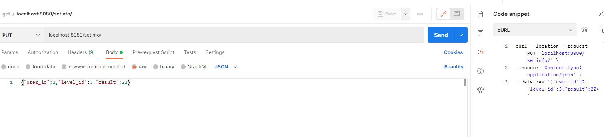
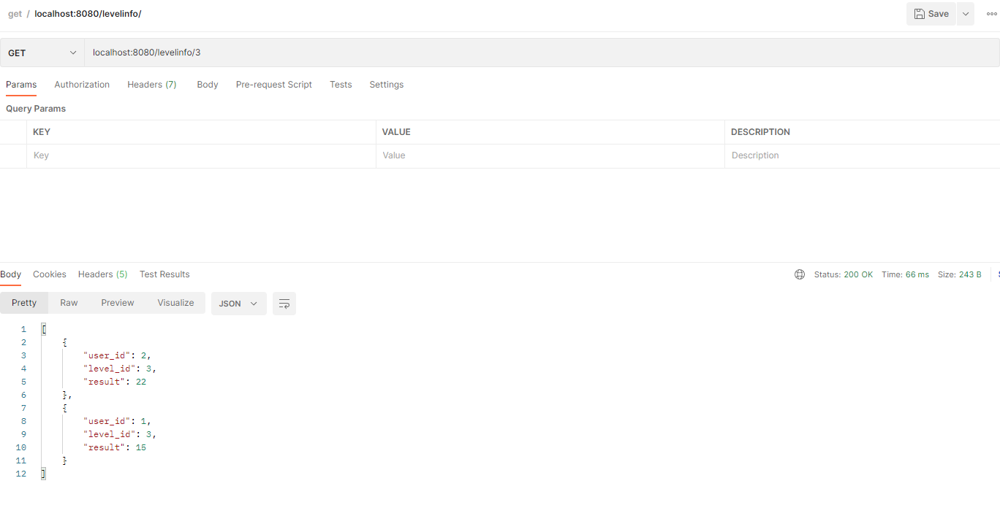
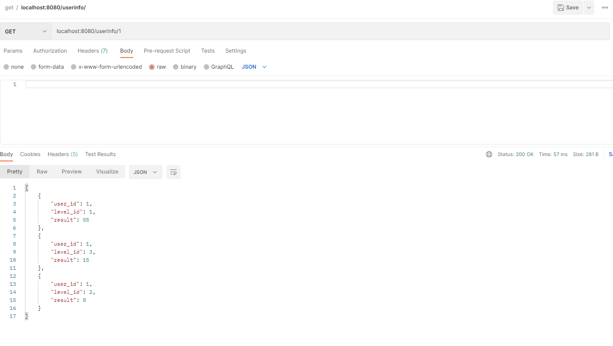

# user-result-board

`Instuction how run applicatian user-result-board:`

* Befor run applicatian in docker you must install docker  as in this instruction https://docs.docker.com/desktop/


```
1. run build_docker_container.bat or build_docker_container.sh.
2. run start_docker_container.bat or start_docker_container.sh.
```

```
If app runs but you get errors, cell developers.
```

* You version.

`Sceeshots work:`

`Put /setinfo`



`Get /levelinfo/{level_id}`



`Get /userinfo/{user_id}`



